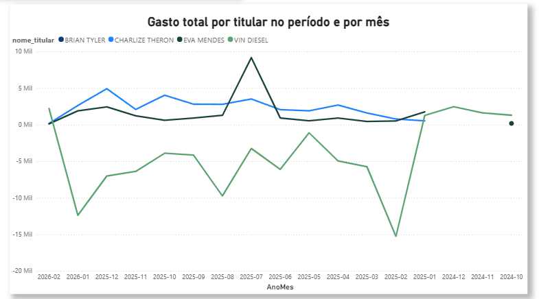
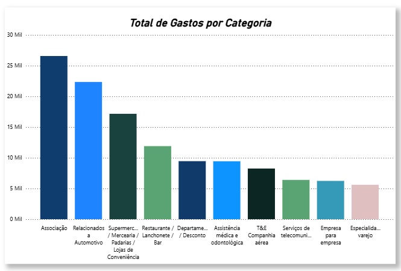
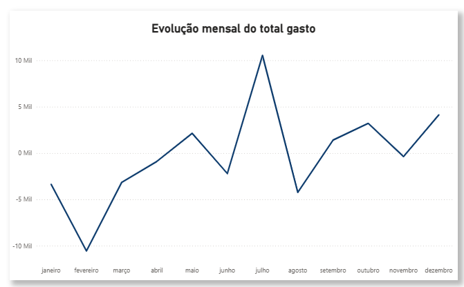
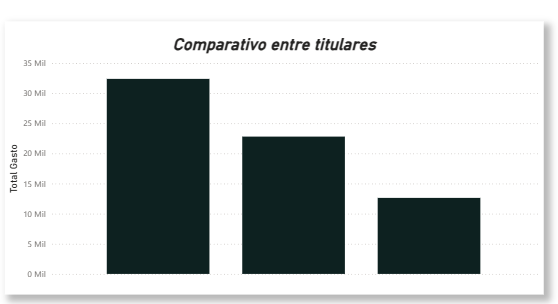
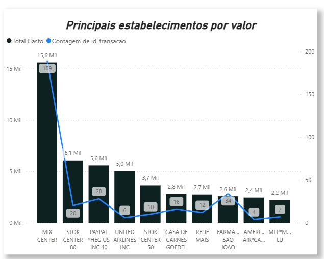
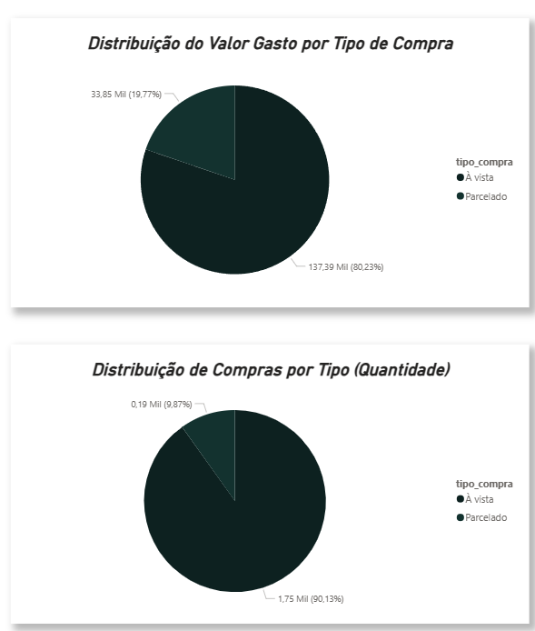
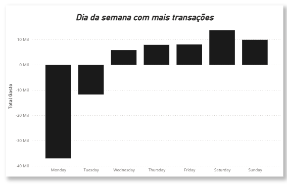
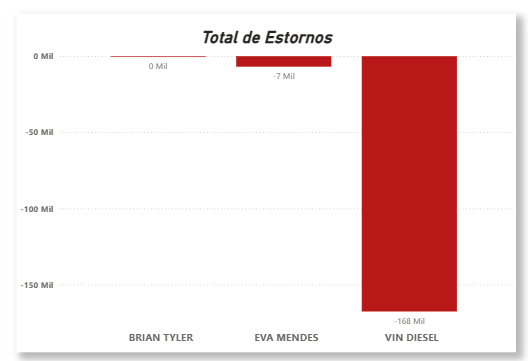

# Projeto BI Data Warehouse: 
# Transações de Cartão de Crédito  💳

# Primeira Fase do Projeto: 

<h2>

Aluno: Igor Alessandretti

 

Matrícula: 202839

 

Curso: Análise e Desenvolvimento de Sistemas 

</h2>

# Objetivo: 

<h2>

Construir um data warehouse a partir de dados reais de faturas de cartão
de crédito, aplicar conceitos de ETL e desenvolver/acoplar ferramentas de análise

</h2>

# 📈 Etapas do Projeto:

- 1. Modelagem do Data Warehouse  
Inicialmente, foi realizado o desenho do modelo dimensional (Star Schema), definindo a tabela fato (fato_transacao) e as dimensões (dim_data, dim_titular, dim_categoria e dim_estabelecimento).

 

- 2. Criação das tabelas no PostgreSQL  
As tabelas foram implementadas no banco de dados PostgreSQL com base no modelo definido, garantindo a estrutura necessária para análise.

 

- 3. Processo ETL (Extração, Transformação e Carga)  
Os dados foram extraídos de 12 arquivos CSV utilizando Python e a biblioteca Pandas.  
Durante a transformação, foram tratados tipos de dados, datas, valores monetários e criadas chaves para as dimensões.  
Após isso, os dados foram carregados no Data Warehouse utilizando SQLAlchemy.

 

- 4. Validação dos dados  
Foram realizadas consultas SQL para verificar a consistência dos dados carregados, como contagem de registros e análise de valores.

 

- 5. Análises e consultas SQL  
Foram desenvolvidas consultas analíticas para responder perguntas de negócio, como gasto por categoria, evolução mensal, comportamento de parcelamento e análise de estornos.

 

<h2>Abaixo como ficou minha modelagem dimensional: </h2>

  

# 📊 Dicionário de Dados

🧾 Tabela: fato_transacao

- id_transacao: Identificador único da transação (Chave Primária).

- id_data: Chave estrangeira referenciando a dimensão de data.

- id_titular: Chave estrangeira referenciando o titular do cartão.

- id_categoria: Chave estrangeira referenciando a categoria da despesa.

- id_estabelecimento: Chave estrangeira referenciando o local da compra.

- valor_brl: Valor da transação em Reais (R$).

- valor_usd: Valor da transação em Dólar (US$).

- cotacao: Taxa de câmbio utilizada para a conversão no dia da compra.

- parcela: Descrição original da parcela (ex: "1/5" ou "Única").

- parcela_texto: Campo de suporte para o tratamento de texto das parcelas.

- num_parcela: Número da parcela específica registrada no evento.

- total_parcelas: Quantidade total de parcelas daquela transação.

 

📅 Tabela: dim_data

- id_data: Identificador único da data (Chave Primária).

- data: Data completa da transação (formato YYYY-MM-DD).

- dia: Dia do mês (1-31).

- mes: Mês da transação (1-12).

- trimestre: Trimestre do ano (1-4).

- ano: Ano da transação.

- dia_semana: Nome do dia da semana em inglês (ex: Saturday, Monday).

 

👤 Tabela: dim_titular

- id_titular: Identificador único do titular (Chave Primária).

- nome_titular: Nome completo do titular do cartão.

- final_cartao: Últimos dígitos do cartão para identificação.

 

🏷️ Tabela: dim_categoria

- id_categoria: Identificador único da categoria (Chave Primária).

- nome_categoria: Descrição do tipo de gasto (ex: Restaurante, Supermercado).

 

🏪 Tabela: dim_estabelecimento

- id_estabelecimento: Identificador único do estabelecimento (Chave Primária).

- nome_estabelecimento: Nome do estabelecimento/descrição da transação.

 

# Segunda Fase do Projeto: 

<h2> O arquivo python contendo código ETL encontra-se em:</h2>

- # [main.py](./etl/main.py)

 

# Terceira Fase do Projeto:

# Consultas SQL: 

# 1 - Gasto total por titular no período e por mês

<h2> Ao executar a consulta: </h2>

    SELECT  t.nome_titular, d.ano, d.mes, SUM(f.valor_brl) AS total_gasto
    FROM  fato_transacao f
    INNER JOIN dim_titular t ON f.id_titular = t.id_titular
    JOIN dim_data d ON f.id_data = d.id_data 
    GROUP BY t.nome_titular, d.ano, d.mes
    ORDER BY t.nome_titular, d.ano, d.mes;

<h2> Obtive como resultado: </h2> 

| "nome_titular"    | "ano" | "mes" | "total_gasto" |
|-------------------|-------|-------|---------------|
| "BRIAN TYLER"     | 2025  | 2     | 356.09        |
| "BRIAN TYLER"     | 2025  | 3     | 551.31        |
| "BRIAN TYLER"     | 2025  | 4     | 465.09        |
| "BRIAN TYLER"     | 2025  | 5     | 829.12        |
| "BRIAN TYLER"     | 2025  | 6     | 948.68        |
| "BRIAN TYLER"     | 2025  | 7     | 1121.99       |
| "BRIAN TYLER"     | 2025  | 8     | 1447.36       |
| "BRIAN TYLER"     | 2025  | 9     | 1836.54       |
| "BRIAN TYLER"     | 2025  | 10    | 1035.73       |
| "BRIAN TYLER"     | 2025  | 11    | 1121.89       |
| "BRIAN TYLER"     | 2025  | 12    | 1352.65       |
| "BRIAN TYLER"     | 2026  | 1     | 970.96        |
| "BRIAN TYLER"     | 2026  | 2     | 590.83        |
| "CHARLIZE THERON" | 2025  | 1     | 520.36        |
| "CHARLIZE THERON" | 2025  | 2     | 771.91        |
| "CHARLIZE THERON" | 2025  | 3     | 1594.24       |
| "CHARLIZE THERON" | 2025  | 4     | 2682.50       |
| "CHARLIZE THERON" | 2025  | 5     | 1892.43       |
| "CHARLIZE THERON" | 2025  | 6     | 2051.89       |
| "CHARLIZE THERON" | 2025  | 7     | 3507.63       |
| "CHARLIZE THERON" | 2025  | 8     | 2779.59       |
| "CHARLIZE THERON" | 2025  | 9     | 2798.52       |
| "CHARLIZE THERON" | 2025  | 10    | 4022.21       |
| "CHARLIZE THERON" | 2025  | 11    | 2080.65       |
| "CHARLIZE THERON" | 2025  | 12    | 4912.33       |
| "CHARLIZE THERON" | 2026  | 1     | 2622.53       |
| "CHARLIZE THERON" | 2026  | 2     | 157.97        |
| "EVA MENDES"      | 2024  | 10    | 171.48        |
| "EVA MENDES"      | 2025  | 1     | 1750.80       |
| "EVA MENDES"      | 2025  | 2     | 504.68        |
| "EVA MENDES"      | 2025  | 3     | 439.81        |
| "EVA MENDES"      | 2025  | 4     | 914.25        |
| "EVA MENDES"      | 2025  | 5     | 535.50        |
| "EVA MENDES"      | 2025  | 6     | 908.54        |
| "EVA MENDES"      | 2025  | 7     | 9171.70       |
| "EVA MENDES"      | 2025  | 8     | 1270.04       |
| "EVA MENDES"      | 2025  | 9     | 913.68        |
| "EVA MENDES"      | 2025  | 10    | 602.06        |
| "EVA MENDES"      | 2025  | 11    | 1211.94       |
| "EVA MENDES"      | 2025  | 12    | 2419.97       |
| "EVA MENDES"      | 2026  | 1     | 1885.83       |
| "EVA MENDES"      | 2026  | 2     | 106.87        |
| "VIN DIESEL"      | 2024  | 10    | 1289.94       |
| "VIN DIESEL"      | 2024  | 11    | 1604.74       |
| "VIN DIESEL"      | 2024  | 12    | 2447.40       |
| "VIN DIESEL"      | 2025  | 1     | 1266.66       |
| "VIN DIESEL"      | 2025  | 2     | -15250.48     |
| "VIN DIESEL"      | 2025  | 3     | -5742.62      |
| "VIN DIESEL"      | 2025  | 4     | -4958.41      |
| "VIN DIESEL"      | 2025  | 5     | -1125.50      |
| "VIN DIESEL"      | 2025  | 6     | -6117.09      |
| "VIN DIESEL"      | 2025  | 7     | -3256.40      |
| "VIN DIESEL"      | 2025  | 8     | -9730.37      |
| "VIN DIESEL"      | 2025  | 9     | -4149.67      |
| "VIN DIESEL"      | 2025  | 10    | -3908.08      |
| "VIN DIESEL"      | 2025  | 11    | -6391.51      |
| "VIN DIESEL"      | 2025  | 12    | -7020.11      |
| "VIN DIESEL"      | 2026  | 1     | -12394.42     |
| "VIN DIESEL"      | 2026  | 2     | 2208.92       |

 

# 2 -  Gasto por categoria (Top 10)

<h2> Ao executar a consulta: </h2>

    SELECT c.nome_categoria, SUM (f.valor_brl) AS total_gasto
    FROM  fato_transacao f 
    INNER JOIN dim_categoria c ON f.id_categoria = c.id_categoria
    GROUP BY c.nome_categoria
    ORDER BY total_gasto DESC
    LIMIT 10;

<h2> Obtive como resultado: </h2> 

| "nome_categoria"                                               | "total_gasto" |
|----------------------------------------------------------------|---------------|
| "Associação"                                                   | 26568.81      |
| "Relacionados a Automotivo"                                    | 22340.05      |
| "Supermercados / Mercearia / Padarias / Lojas de Conveniência" | 17161.40      |
| "Restaurante / Lanchonete / Bar"                               | 11896.64      |
| "Departamento / Desconto"                                      | 9449.48       |
| "Assistência médica e odontológica"                            | 9431.73       |
| "T&E Companhia aérea"                                          | 8250.47       |
| "Serviços de telecomunicações"                                 | 6397.87       |
| "Empresa para empresa"                                         | 6233.95       |
| "Especialidade varejo"                                         | 5601.71       |

 

# 3 - Evolução mensal do total gasto

<h2> Ao executar a consulta: </h2>

    SELECT d.ano,d.mes,
    SUM(f.valor_brl) AS total_gasto
    FROM fato_transacao f
    JOIN dim_data d ON f.id_data = d.id_data
    GROUP BY d.ano, d.mes
    ORDER BY d.ano, d.mes;

<h2> Obtive como resultado: </h2> 

| "ano" | "mes" | "total_gasto" |
|-------|-------|---------------|
| 2024  | 10    | 1461.42       |
| 2024  | 11    | 1604.74       |
| 2024  | 12    | 2447.40       |
| 2025  | 1     | 3537.82       |
| 2025  | 2     | -13617.80     |
| 2025  | 3     | -3157.26      |
| 2025  | 4     | -896.57       |
| 2025  | 5     | 2131.55       |
| 2025  | 6     | -2207.98      |
| 2025  | 7     | 10544.92      |
| 2025  | 8     | -4233.38      |
| 2025  | 9     | 1399.07       |
| 2025  | 10    | 1751.92       |
| 2025  | 11    | -1977.03      |
| 2025  | 12    | 1664.84       |
| 2026  | 1     | -6915.10      |
| 2026  | 2     | 3064.59       |

 

# 4 - Comparativo entre titulares

<h2> Ao executar a consulta: </h2>

    SELECT t.nome_titular,
    COUNT(f.id_transacao) AS qtd_transacoes,
    SUM(f.valor_brl) AS total_gasto,
    AVG(f.valor_brl) AS media_por_transacao
    FROM fato_transacao f
    JOIN dim_titular t ON f.id_titular = t.id_titular
    WHERE f.valor_brl > 0
    GROUP BY t.nome_titular
    ORDER BY total_gasto DESC;

<h2> Obtive como resultado: </h2> 

| "nome_titular"    | "qtd_transacoes" | "total_gasto" | "media_por_transacao" |
|-------------------|------------------|---------------|-----------------------|
| "VIN DIESEL"      | 705              | 96424.57      | 136.7724397163120567  |
| "CHARLIZE THERON" | 401              | 32394.76      | 80.7849376558603491   |
| "EVA MENDES"      | 239              | 29698.99      | 124.2635564853556485  |
| "BRIAN TYLER"     | 565              | 12715.94      | 22.5060884955752212   |

 

# 5 - Principais estabelecimentos por valor

<h2> Ao executar a consulta: </h2>

    SELECT e.nome_estabelecimento,
    SUM(f.valor_brl) AS total_gasto
    FROM fato_transacao f
    JOIN dim_estabelecimento e ON f.id_estabelecimento = e.id_estabelecimento
    GROUP BY e.nome_estabelecimento
    ORDER BY total_gasto DESC
    LIMIT 10;

<h2> Obtive como resultado: </h2> 

| "nome_estabelecimento"      | "total_gasto" |
|-----------------------------|---------------|
| "MIX CENTER"                | 15603.04      |
| "STOK CENTER 80"            | 6065.97       |
| "PAYPAL *HEG US INC     40" | 5588.21       |
| "UNITED AIRLINES INC"       | 5035.84       |
| "STOK CENTER 50"            | 3650.26       |
| "CASA DE CARNES GOEDEL"     | 2783.74       |
| "REDE MAIS"                 | 2744.30       |
| "FARMACIA SAO JOAO"         | 2573.99       |
| "AMERICAN AIR*CAPTURERE"    | 2447.40       |
| "MLP*MAGALU-MAGAZINE LU"    | 2223.90       |

 

# 6 - Comportamento de parcelamento 

# Consulta 1: 

    SELECT 
        CASE 
            WHEN f.num_parcela = 1 THEN 'À vista'
            ELSE 'Parcelado'
        END AS tipo_compra,
        COUNT(*) AS quantidade,
        SUM(f.valor_brl) AS total_gasto
    FROM fato_transacao f
    GROUP BY tipo_compra;

<h2> Obtive como resultado: </h2> 

| "tipo_compra" | "quantidade" | "total_gasto" |
|---------------|--------------|---------------|
| "À vista"     | 1753         | -37241.98     |
| "Parcelado"   | 192          | 33845.13      |

 

# Consulta 2: 

    SELECT 
        CASE 
            WHEN f.num_parcela = 1 THEN 'À vista'
            ELSE 'Parcelado'
        END AS tipo_compra,
        COUNT(*) AS quantidade,
        SUM(f.valor_brl) AS total_gasto
    FROM fato_transacao f
    WHERE f.valor_brl > 0
    GROUP BY tipo_compra;

<h2> Obtive como resultado: </h2> 

| "tipo_compra" | "quantidade" | "total_gasto" |
|---------------|--------------|---------------|
| "À vista"     | 1718         | 137389.13     |
| "Parcelado"   | 192          | 33845.13      |

 

# Insight 💡:

<strong>Na análise de compras à vista versus parceladas, observou-se inicialmente que o total gasto em compras à vista apresentava valor negativo, indicando a presença significativa de estornos ou créditos nesse tipo de transação.

Após aplicar um filtro considerando apenas valores positivos, verificou-se que compras à vista representam a maior parte das transações, tanto em quantidade quanto em valor total gasto.

Isso indica que o comportamento predominante dos titulares é realizar compras à vista, concentrando a maior parte do volume financeiro nesse tipo de operação. </strong>

 

# 7 - Dia da semana com mais transações

<h2> Ao executar a consulta: </h2>

    SELECT d.dia_semana,
    COUNT(f.id_transacao) AS qtd_transacoes,
    SUM(f.valor_brl) AS total_gasto
    FROM fato_transacao f
    JOIN dim_data d ON f.id_data = d.id_data
    GROUP BY d.dia_semana
    ORDER BY total_gasto DESC;

<h2> Obtive como resultado: </h2> 

| "dia_semana" | "qtd_transacoes" | "total_gasto" |
|--------------|------------------|---------------|
| "Saturday"   | 168              | 13687.37      |
| "Sunday"     | 121              | 9892.96       |
| "Friday"     | 351              | 8066.58       |
| "Thursday"   | 342              | 7892.86       |
| "Wednesday"  | 310              | 5818.79       |
| "Tuesday"    | 328              | -11734.96     |
| "Monday"     | 325              | -37020.45     |

 

# Insight 💡:

<strong>A análise por dia da semana mostra maior volume de gastos no final de semana, especialmente no sábado e domingo.

Observa-se também que segunda-feira e terça-feira apresentam valores negativos, indicando a ocorrência de estornos ou créditos nessas datas. Esse comportamento pode impactar a análise do total gasto, pois reduz artificialmente os valores nesses dias.

Ainda assim, é possível identificar que o padrão de consumo se concentra no final de semana, enquanto os dias úteis mantêm um volume mais distribuído de transações. </strong>

 

# 8 - Estornos e créditos

<h2> Ao executar a consulta: </h2>

    SELECT t.nome_titular,
    SUM(f.valor_brl) AS total_estornos
    FROM fato_transacao f
    JOIN dim_titular t ON f.id_titular = t.id_titular
    WHERE f.valor_brl < 0
    GROUP BY t.nome_titular;

<h2> Obtive como resultado: </h2> 

| "nome_titular" | "total_estornos" |
|----------------|------------------|
| "BRIAN TYLER"  | -87.70           |
| "VIN DIESEL"   | -167651.57       |
| "EVA MENDES"   | -6891.84         |

 

# Insight 💡: 

<strong>A análise de estornos e créditos por titular mostra uma forte concentração em um único indivíduo, com destaque para o titular "VIN DIESEL", que apresenta um valor significativamente superior aos demais.

Esse comportamento pode indicar um alto volume de cancelamentos, reembolsos ou possíveis inconsistências nos dados associados a esse titular.

Os demais titulares apresentam valores de estorno relativamente baixos, sugerindo um padrão mais estável de transações.</strong>

 

<h2>Todas as consultas SQL estão em: </h2>

- [ConsultasSQL](./SQL/)

 

# Quarta fase do projeto 
 <h2> Dashboards: </h2>

# OBS: 

<h1> O arquuivo pdf do dashboard encontra-se em:

 

[Dashboard](./dashboardCartao_bi.pdf) </h1>

<h2> 1 - Gasto total por titular no período e por mês </h2>

Descrição: Gráfico de séries temporais comparativo entre os titulares dos cartões (Brian Tyler, Charlize Theron, Eva Mendes e Vin Diesel).

Objetivo: Analisar o comportamento de gasto individual mês a mês. É fundamental para identificar anomalias, como o alto volume de estornos (valores negativos) concentrados em um único titular.

<h2>2 -  Gasto por categoria (Top 10)</h2>

Descrição: Gráfico de barras verticais que segmenta o volume financeiro por tipo de serviço ou produto (Associação, Automotivo, Supermercado, etc.).

Objetivo: Prover uma visão clara sobre o perfil de consumo, destacando quais setores do mercado retêm a maior parte do orçamento.

<h2> 3 - Evolução mensal do total gasto </h2>

Descrição: Gráfico de linha que apresenta a flutuação dos gastos ao longo dos meses do ano.

Objetivo: Identificar meses de maior consumo e sazonalidade financeira. Permite observar picos de gastos (como em Julho) e quedas bruscas (como em Fevereiro).

<h2> 4 - Comparativo entre titulares </h2>

Descrição: Gráfico de barras simples focado no valor acumulado de gastos positivos por pessoa.

Objetivo: Comparar diretamente o "poder de compra" ou o volume de gastos real entre os usuários, excluindo estornos para uma análise de consumo limpa.

<h2> 5 - Principais estabelecimentos por valor</h2>

Descrição: Gráfico combinado de colunas (valor total) e linha (quantidade de transações).

Objetivo: Rankear os estabelecimentos onde houve maior concentração de capital. A linha de contagem ajuda a entender se o gasto alto é fruto de muitas compras pequenas ou poucas compras de alto valor.

<h2> 6 - Comportamento de parcelamento</h2>

Descrição: Gráfico de pizza que mostra a proporção financeira entre compras "À vista" e "Parceladas".

Objetivo: Revelar o impacto financeiro de cada modalidade. No cenário atual, embora as compras à vista sejam mais frequentes, as parceladas representam uma fatia significativa do valor total.

<h2>7 - Dia da semana com mais transações</h2>

<h2> 8 - Estornos e créditos </h2>

Descrição: Gráfico de colunas que isola apenas os valores negativos (créditos/devoluções) por titular.

Objetivo: Destacar visualmente disparidades em devoluções. O uso da cor vermelha enfatiza casos críticos, como o volume atípico de estornos na conta do titular Vin Diesel.

