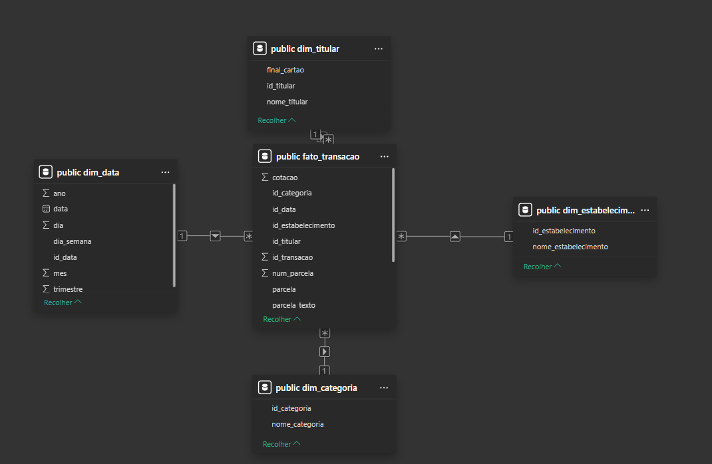

# Projeto BI Data Warehouse: 
# Transações de Cartão de Crédito  💳

# Primeira Fase do Projeto: 

<h2>

Aluno: Igor Alessandretti

 

Matrícula: 202839

 

Curso: Análise e Desenvolvimento de Sistemas 

</h2>

# Objetivo: 

<h2>

Construir um data warehouse a partir de dados reais de faturas de cartão
de crédito, aplicar conceitos de ETL e desenvolver/acoplar ferramentas de análise

</h2>

# 📈 Etapas do Projeto:

- 1. Modelagem do Data Warehouse  
Inicialmente, foi realizado o desenho do modelo dimensional (Star Schema), definindo a tabela fato (fato_transacao) e as dimensões (dim_data, dim_titular, dim_categoria e dim_estabelecimento).

 

- 2. Criação das tabelas no PostgreSQL  
As tabelas foram implementadas no banco de dados PostgreSQL com base no modelo definido, garantindo a estrutura necessária para análise.

 

- 3. Processo ETL (Extração, Transformação e Carga)  
Os dados foram extraídos de 12 arquivos CSV utilizando Python e a biblioteca Pandas.  
Durante a transformação, foram tratados tipos de dados, datas, valores monetários e criadas chaves para as dimensões.  
Após isso, os dados foram carregados no Data Warehouse utilizando SQLAlchemy.

 

- 4. Validação dos dados  
Foram realizadas consultas SQL para verificar a consistência dos dados carregados, como contagem de registros e análise de valores.

 

- 5. Análises e consultas SQL  
Foram desenvolvidas consultas analíticas para responder perguntas de negócio, como gasto por categoria, evolução mensal, comportamento de parcelamento e análise de estornos.

 

<h2>Abaixo como ficou minha modelagem dimensional: </h2>

<h2> O arquivo python contendo código ETL encontra-se em:</h2>

- # [main.py](./etl/main.py)

  

# 📊 Dicionário de Dados

🧾 Tabela: fato_transacao

- id_transacao: Identificador único da transação (Chave Primária).

- id_data: Chave estrangeira referenciando a dimensão de data.

- id_titular: Chave estrangeira referenciando o titular do cartão.

- id_categoria: Chave estrangeira referenciando a categoria da despesa.

- id_estabelecimento: Chave estrangeira referenciando o local da compra.

- valor_brl: Valor da transação em Reais (R$).

- valor_usd: Valor da transação em Dólar (US$).

- cotacao: Taxa de câmbio utilizada para a conversão no dia da compra.

- parcela: Descrição original da parcela (ex: "1/5" ou "Única").

- parcela_texto: Campo de suporte para o tratamento de texto das parcelas.

- num_parcela: Número da parcela específica registrada no evento.

- total_parcelas: Quantidade total de parcelas daquela transação.

 

📅 Tabela: dim_data

- id_data: Identificador único da data (Chave Primária).

- data: Data completa da transação (formato YYYY-MM-DD).

- dia: Dia do mês (1-31).

- mes: Mês da transação (1-12).

- trimestre: Trimestre do ano (1-4).

- ano: Ano da transação.

- dia_semana: Nome do dia da semana em inglês (ex: Saturday, Monday).

 

👤 Tabela: dim_titular

- id_titular: Identificador único do titular (Chave Primária).

- nome_titular: Nome completo do titular do cartão.

- final_cartao: Últimos dígitos do cartão para identificação.

 

🏷️ Tabela: dim_categoria

- id_categoria: Identificador único da categoria (Chave Primária).

- nome_categoria: Descrição do tipo de gasto (ex: Restaurante, Supermercado).

 

🏪 Tabela: dim_estabelecimento

- id_estabelecimento: Identificador único do estabelecimento (Chave Primária).

- nome_estabelecimento: Nome do estabelecimento/descrição da transação.

 

